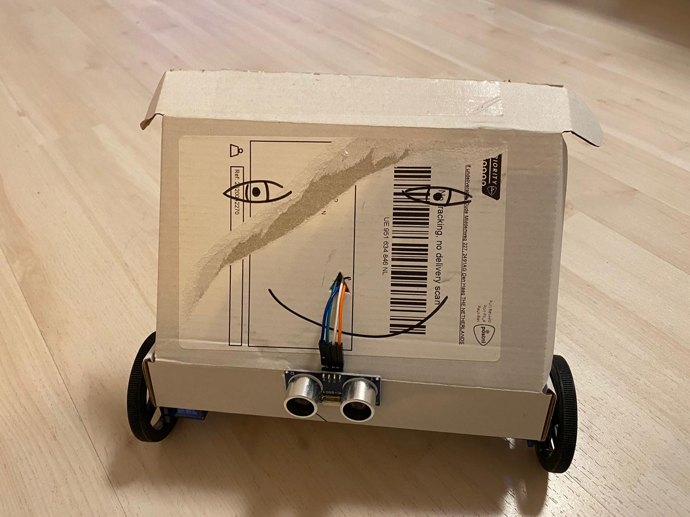
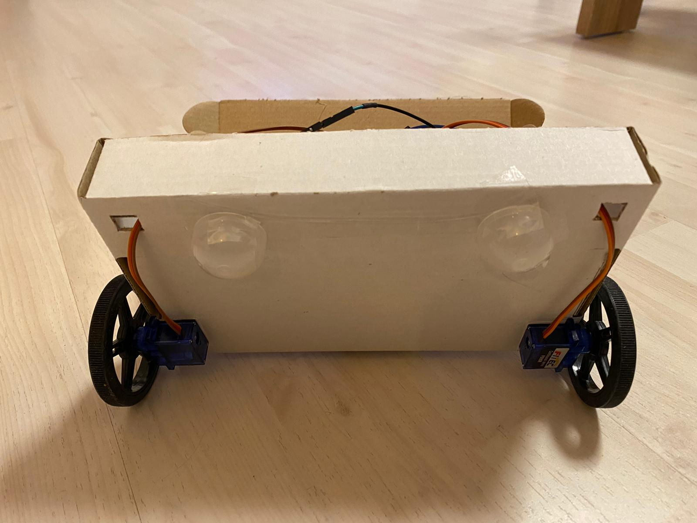
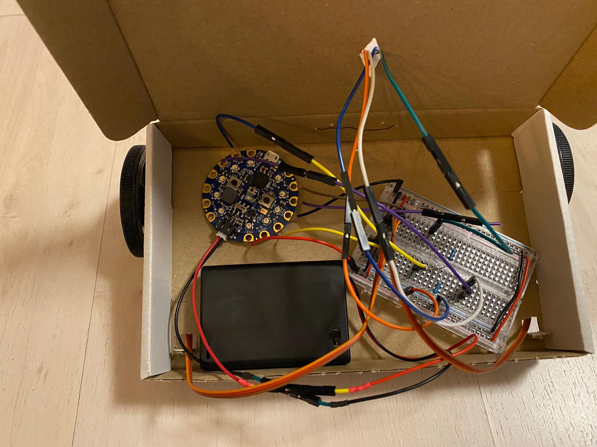

# Bluefruit Racing Robot

This repository is about building a small "raceing robot" using an
[Adafruit Bluefruit](https://learn.adafruit.com/adafruit-circuit-playground-bluefruit).

# Why Bluefruit is awesome

- As in many of Adafruit's boards, **Python is well supported**.
  It is a "first class citizen" in programming languages for that board.
  Hardware is well supported and the Python ecosystem is quite mature.
- Other languages are supported as well, e.g.
  [C++ using the Arduino API](https://learn.adafruit.com/adafruit-circuit-playground-bluefruit/arduino-support-setup)
  or even
  [Go](https://tinygo.org/microcontrollers/circuit-playground-bluefruit/).
- It is possible to run machine learning applications on the board by using
  [TensorFlow Lite](https://www.tensorflow.org/lite/microcontrollers).
- The chip is Bluetooth Low Energy, BLE, capable.
  Thus it is possible to connect Android/iOS devices to it.
  You can use this to write your own "robot remote control" app or to run your TensorFlow Analysis on a camera image on the smartphone and then send the output to Bluefruit.
- For beginners, it has LEDs, some Buttons, Sensors directly on-chip, so you can get started without any wiring necessary.
- For more advanced use, you can easily attach stuff through the Pins.

# Impressions of the Robot

The chassis is a simple box, the Ultrasonic mounted to the front:

It has two wheels on continuous servos, one at each side at the front, and two hemispheres at the back (sliding over the ground):

Inside, it's the cabeling -- looks messy, but is actually not that bad:

# Notes on using...

- CircuitPython:
  See
  [the introduction](https://learn.adafruit.com/adafruit-circuit-playground-bluefruit/what-is-circuitpython)
  and
  [the documentation](https://circuitpython.readthedocs.io/en/5.0.x/docs/index.html).
- CircuitPython libraries:
  The libraries for this project are described in `requirements.txt`.
  See
  [here](https://learn.adafruit.com/adafruit-circuit-playground-bluefruit/circuit-playground-bluefruit-circuitpython-libraries)
  for how to install them.
- Voltages larger than 3.3V:
  The Bluefruit uses 3.3V internally and on the digital IO pins.
  If you apply more than that to a pin, it might get damaged.
- Ultrasonic Sensors:
  The Ultrasonic Sensor
  [HC-SR04](https://www.adafruit.com/product/3942)
  needs 5V input voltage to operate.
  To trigger it (i.e. to make it send an ultrasonic pulse), it is sufficient to apply 3.3V to the Trigger pin.
  It then outputs the distance encoded with a 5V signal, though.
  To protect the Bluefruit, a level shifter or voltage divider needs to be in place.
  What works well is to use two resistors like so:

        Ultrasonic Echo Pin
         |
        5.1 kOhm (green brown black brown brown)
         |
        input pin in Bluefruit
         |
        10 kOhm (brown black black red brown)
         |
        GND

    Unfortunately, the sensor readings are only reliable _most of the time_.
    You need to add some robustification (e.g. filter outliers) to use them reliably.
- Servos:
  Servos usually have an input to consume voltage to operate the motor (typically they are faster the more voltage is applied there) and a second input to control the speed/angle.
  The power input should be applied with about 4.8V - 6V.
  The second (control) input can be lower -- 3.3V output suffices.
- The [Bread Board](https://en.wikipedia.org/wiki/Breadboard):
  You can attach a wire in each single small hole.
  The two outer vertikal lines of holes are connected vertically.
  They are used to supply Vcc (positive voltage) and GND (zero voltage) to the whole board.
  The other holes are connected horizontally (but the left hand side part and the right hand side part are split in the middle).
  This allows to place components to wire on the board and wire them to each other and to Vcc/GND with small wires.
- Audio:
  The `fanfare.wav` is created from
  [this](https://freesound.org/people/CGEffex/sounds/99961/)
  and
  [this](https://freesound.org/people/Robinhood76/sounds/62176/)
  free sounds using the instructions
  [here](https://www.3cx.com/docs/converting-wav-file/).
  Make sure to use _PCM, 16 bit, mono 22050 Hz_.

# Where to go from here

Plug the Bluefruit in, play with it.
Use the Pins for touch intput, play sounds, use the built-in sensors.
Attach it to other hardware.
You will soon get an idea for a project :-)
